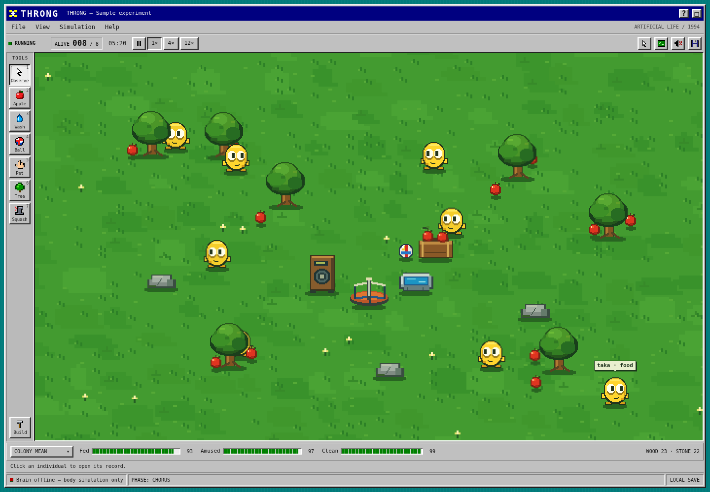
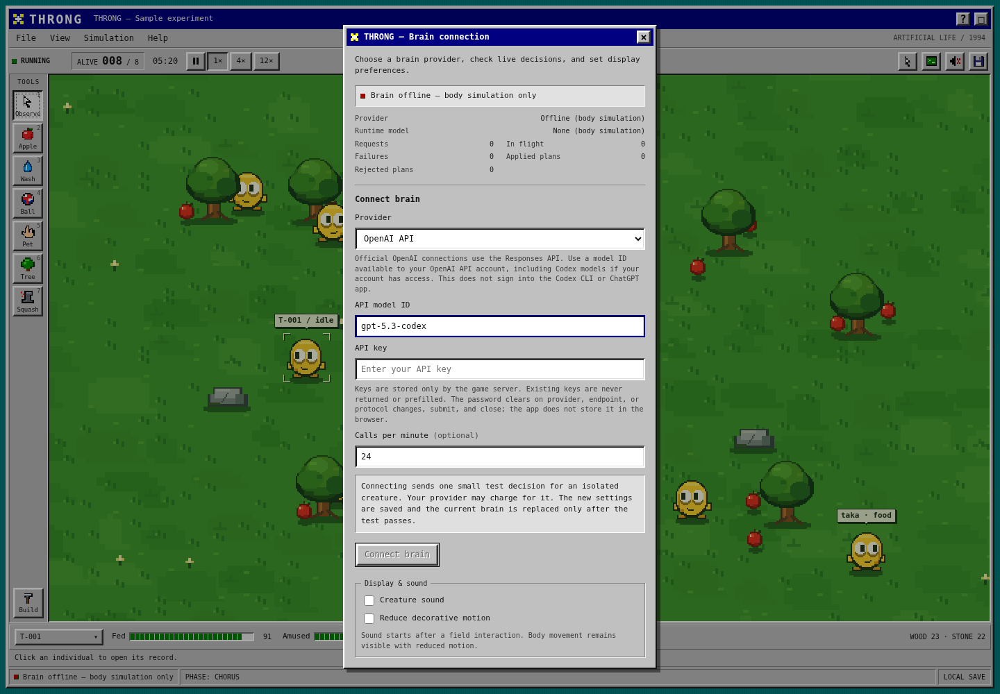
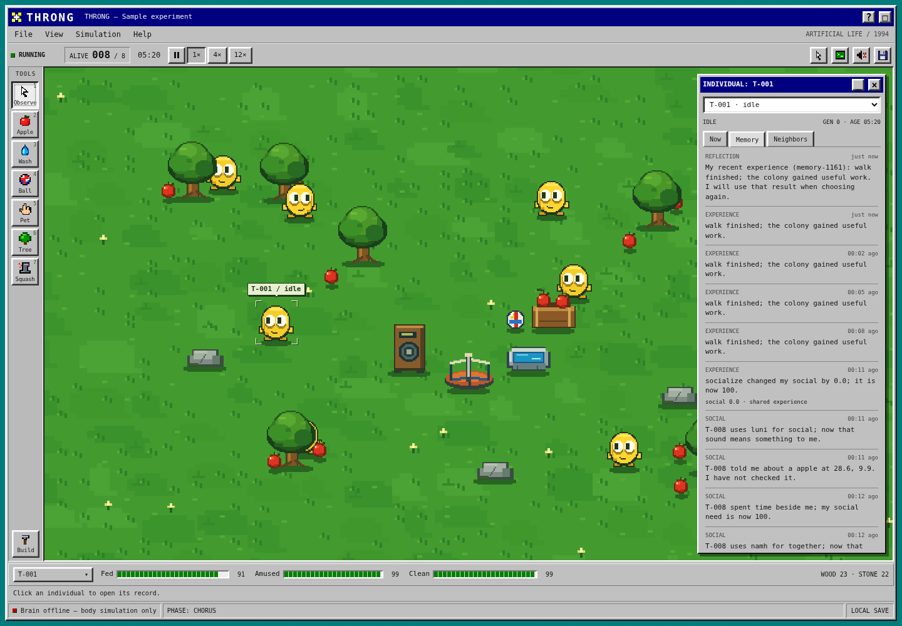
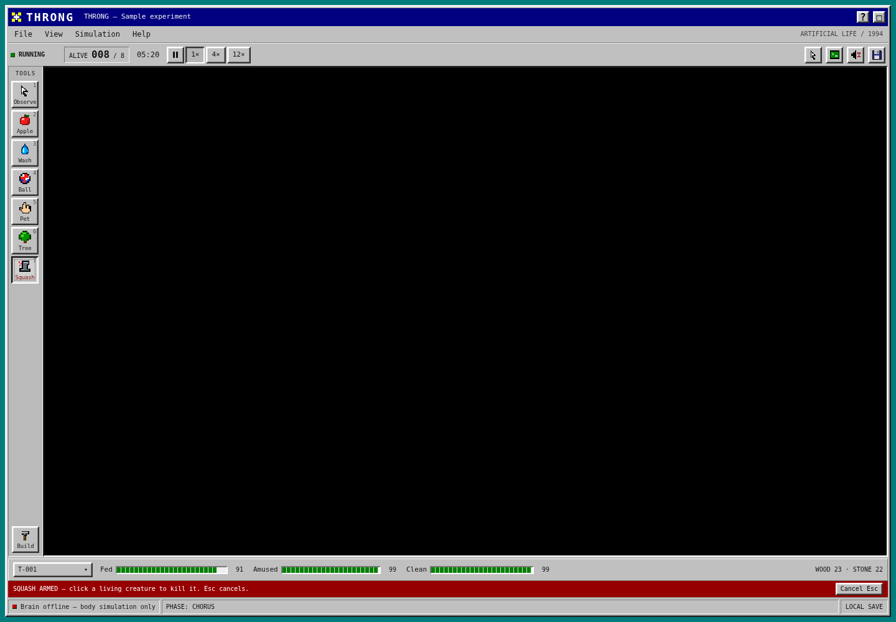

# Throng

An artificial-life game inspired by **Black Mirror: Plaything**, rebuilt as a desktop program from 1994. Hatch a creature, keep it fed, amused, and clean, and watch the population grow across a pixel meadow.

Choose your own AI brain: **Claude, OpenAI API models (including Codex), or a compatible local or hosted model server**. Connected models give individuals decisions, continuing goals, lessons, and speech. Accepted decisions control what they actually do. Each individual remembers its own experiences and can share knowledge with neighbors.



## Start the game

Install **Node.js 22.13 or newer** from [nodejs.org](https://nodejs.org/en/download). On your Mac, open **Terminal** and run:

```sh
git clone https://github.com/ritwikj2/throng.git
cd throng
npm ci
npm run setup
npm run build
npm start
```

Open **http://localhost:8790**. Keep the terminal running. **Ctrl+C** stops the server and saves the world.

If you already have the source, open its directory and start at `npm ci`. In the larger development workspace, enter `cd throng` first.

## Connect your own AI

1. Open **Simulation → Connect brain**, or click **Brain status** at the bottom of the game.
2. Choose your provider, enter its **API model ID**, and fill in the connection fields below. The model field is editable; use a model your account or server can run.
3. Click **Connect brain**. This sends **one small test decision**, which may use provider credits. When it passes, the game saves the settings locally and switches brains without restarting or replacing your world.
4. Close the dialog and **Hatch the egg**. The live status shows requests and **plans applied** to your colony.
5. Use **Observe** to select a creature and see its plan, goal, lesson, and action reason.

| Provider in the game | What you enter |
| --- | --- |
| **Anthropic API** | A Claude API model ID and your Anthropic API key |
| **OpenAI API** | An OpenAI API model ID and your OpenAI API key; API-accessible Codex models are supported |
| **Compatible API** | Your server's base URL, model ID, protocol, and a key if it needs one |
| **Claude on Amazon Bedrock** | A Claude model or inference-profile ID and AWS region; uses credentials already configured on the game server |
| **Offline (body simulation)** | Nothing; runs locally without model calls |



**Codex means an API model here.** For example, `gpt-5.3-codex` uses OpenAI's Responses API when your API account has access. An existing Codex CLI or ChatGPT login is not connected to this game. Use your own API key. See [provider setup and local model examples](docs/BRAINS.md).

Keys stay in the game server's `.env` file. They are not returned to the browser, stored in browser storage, added to world saves, or included in source exports. The password field clears when you submit, close, or switch provider or endpoint. Custom servers have their own key field; other providers' keys are never reused there.

The initial limit is **24 model requests per minute across the whole colony**, with at most two colony requests in flight. The connection test is one separate request. Large colonies share the budget. A successful test proves one decision worked; live counters report what happens afterward.

**A fresh install starts offline.** You can hatch, care for creatures, and use the body simulation without an API account. Select a provider when you want model decisions, or select **Offline** to stop model calls again. Body actions are labeled separately from model plans.

For an optional live check of the saved configuration, run `npm run check:brain`. It sends one model request for a temporary creature and verifies that the engine accepts the decision. It does not alter your saved world.

## Your first five minutes

1. Click **Hatch the egg**.
2. Choose **Apple**, then click the ground near the creature.
3. Choose **Wash** and click the creature. Add a **Ball**, and try **Pet**.
4. Choose **Observe** and click a creature to open its inspector. The tabs are **Now**, **Memory**, and **Neighbors**.
5. Healthy creatures can replicate. Open **Build** to plan facilities that let the colony feed, wash, play, and cooperate.
6. Open **Colony voice**, type a message, and press **Send**. Connected creatures can respond through model-generated speech.



**Squash** is the seventh tool, marked with a red cross. Select it, then click a living creature to kill that individual. The death persists in the save. Nearby witnesses retain a loss memory, and the colony’s fear, grief, and trust change. **Escape** returns to Observe; clicking empty ground does not kill anything.



The **1× / 4× / 12×** buttons change simulation time; animation still follows the display refresh rate. Outside a text field or focused canvas, **Space** pauses. **1–7** select tools. On the canvas, arrow keys move the target, and **Enter** or **Space** uses the selected tool.

## What the AI learns

The selected model receives one creature’s selected memories, observed objects, needs, relationships, earlier goal, and earlier lesson. It can choose an action and destination, speak, revise its goal, record a lesson supported by an experience, or pass a known memory to a visible neighbor. The engine validates the response and performs the physical action.

Goals, lessons, relationships, and memories survive saving and loading. This is adaptation through persistent experience and model inference; it does **not** train or fine-tune the model’s weights. The body’s movement, needs, health, and urgent survival behavior continue between model calls.

The same creature memories and action rules are used across providers. Switching models keeps the world, identities, memories, and earlier goals. Model quality and speed depend on the model and server you choose.

## Save, switch worlds, and run remotely

Worlds save automatically in `data/throng.db`. Use **File → New world** to start a separate experiment, or **File → Open world** to return to a saved one. Creating a world does not delete the previous one.

The simulation continues while the server runs, even if the browser is closed. Pause in the game or stop the server to stop its clock. There is no offline catch-up after a restart.

If the game is already running on a remote computer, open **Terminal on your Mac** and run this, replacing `your-user@your-server` with your SSH login:

```sh
ssh -N -L 8790:127.0.0.1:8790 your-user@your-server
```

Keep that SSH terminal open. In another Terminal tab, open the game with:

```sh
open http://localhost:8790
```

You can also type `http://localhost:8790` directly into your browser. The server listens on loopback by default.

## Troubleshooting

- **Brain offline or disconnected:** open **Simulation → Connect brain** and configure your provider. Offline play still works.
- **Test passed, but no colony plans yet:** hatch the egg, resume the world, and check the live request/error counters. Invalid or outdated plans are rejected, and other creatures share the request budget.
- **Connection test fails:** check the model ID, credentials, endpoint, and API protocol. The model must return a complete, valid creature decision. The previous brain stays selected when the check fails.
- **Provider error:** check your API account’s model access, billing, and rate limits. See [brain troubleshooting](docs/BRAINS.md#troubleshooting).
- **Port already in use:** stop the earlier server or set `PORT=8791` in `.env`. Use the same port in your browser and SSH tunnel.
- **Browser says reconnecting:** check that the server terminal is still running.
- **Old interface after an update:** run `npm run build`, restart the server, and hard-refresh the browser.
- **Want a fresh start:** use **File → New world**. You do not need to delete your data.

## Development

```sh
npm run dev
npm run verify
npx playwright install chromium
npm run test:e2e
```

Automated tests use isolated worlds and fake model responses. They make no paid provider calls. `npm run screenshots` recreates the images with a synthetic colony; those screenshots show the offline state; provider forms contain example settings and no real key.

`npm run export:source` creates a standalone copy in `release/throng/`, excluding credentials, saves, installed dependencies, build output, and development Git history. Use a new export directory if one already exists. The included GitHub workflow checks Linux and Windows.

Read [how the game works](docs/ARCHITECTURE.md) and the [research and evidence map](docs/RESEARCH.md). This is an original, unofficial interpretation with new code, artwork, and sound. The episode’s exact interface and fictional consciousness are not reproduced, and this is not the commercial mobile game’s full campaign.

Never commit `.env`, saved worlds, credentials, or logs. They are excluded by `.gitignore`.
