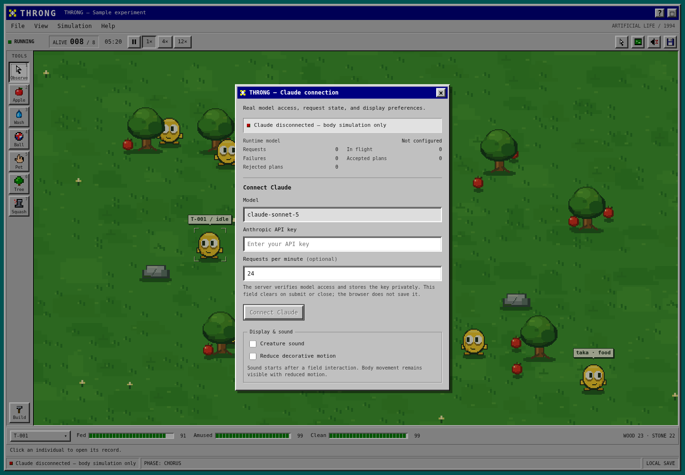

# Throng

An artificial-life game inspired by **Black Mirror: Plaything**, rebuilt as a desktop program from 1994. Hatch a creature, keep it fed, amused, and clean, and watch the population grow across a pixel meadow.

Connect your own **Claude Sonnet 5** account to give individuals model-driven decisions, continuing goals, lessons, and speech. Accepted decisions control what they actually do. Each individual remembers its own experiences and can share knowledge with neighbors.


## Start the game

Install **Node.js 22.13 or newer** from [nodejs.org](https://nodejs.org/en/download). On your Mac, open **Terminal** and run:

```sh
git clone https://github.com/ritwikj2/elsewhere.git
cd elsewhere
npm ci
npm run setup
npm run build
npm start
```

Open **http://localhost:8790**. Keep the terminal running. **Ctrl+C** stops the server and saves the world.

If you already have the source, open its directory and start at `npm ci`. In the larger development workspace, enter `cd throng` first.

## Connect Claude

1. In the game, open **Simulation → Connect Claude**. You can also click the Claude status at the bottom of the window.
2. Enter your own **Anthropic API key** with access to `claude-sonnet-5`.
3. Click **Connect Claude**. The server checks access, saves the key locally, and activates the connection without a restart.
4. Close the dialog and hatch the egg. Once a decision is applied, the status shows **plans applied**.
5. Use **Observe** to select a creature. Its inspector shows the current plan, continuing goal, lesson, and action reason.



The key stays in the server’s private `.env` file; it is not saved in browser storage, world saves, or source exports. Calls use your Anthropic account. The initial limit is **24 requests per minute across the whole colony**, with at most two requests running at once. Large colonies share that budget.

**Without a key, the game runs its body simulation and displays Claude as disconnected.** It does not present those actions as Claude’s thoughts. Model access verification is separate from successful inference: the live status reports requests, errors, and plans actually applied.

You can also edit `.env` manually and restart:

```dotenv
THRONG_BRAIN=anthropic
THRONG_MODEL=claude-sonnet-5
ANTHROPIC_API_KEY=your-own-key
THRONG_CALLS_PER_MINUTE=24
THRONG_THINK_INTERVAL_SECONDS=8
THRONG_BRAIN_TIMEOUT_MS=25000
```

For a separate live check, run `npm run check:claude`. It makes **one model request** against a temporary creature and checks that the engine accepts the decision. It does not alter your saved world.

## Your first five minutes

1. Click **Hatch the egg**.
2. Choose **Apple**, then click the ground near the creature.
3. Choose **Wash** and click the creature. Add a **Ball**, and try **Pet**.
4. Choose **Observe** and click a creature to open its inspector. The tabs are **Now**, **Memory**, and **Neighbors**.
5. Healthy creatures can replicate. Open **Build** to plan facilities that let the colony feed, wash, play, and cooperate.
6. Open **Colony voice**, type a message, and press **Send**. Connected creatures can respond through model-generated speech.


**Squash** is the seventh tool, marked with a red cross. Select it, then click a living creature to kill that individual. The death persists in the save. Nearby witnesses retain a loss memory, and the colony’s fear, grief, and trust change. **Escape** returns to Observe; clicking empty ground does not kill anything.


The **1× / 4× / 12×** buttons change simulation time; animation still follows the display refresh rate. Outside a text field or focused canvas, **Space** pauses. **1–7** select tools. On the canvas, arrow keys move the target, and **Enter** or **Space** uses the selected tool.

## What the AI learns

Claude receives one creature’s selected memories, observed objects, needs, relationships, earlier goal, and earlier lesson. It can choose an action and destination, speak, revise its goal, record a lesson supported by an experience, or pass a known memory to a visible neighbor. The engine validates the response and performs the physical action.

Goals, lessons, relationships, and memories survive saving and loading. This is adaptation through persistent experience and model inference; it does **not** train or fine-tune Claude’s weights. The body’s movement, needs, health, and urgent survival behavior continue between model calls.

Choose `THRONG_BRAIN=local` for explicitly offline play. Advanced OpenAI and Bedrock adapters also remain available through `.env`; the built-in connection dialog configures Claude Sonnet 5 through Anthropic directly.

## Save, switch worlds, and run remotely

Worlds save automatically in `data/throng.db`. Use **File → New world** to start a separate experiment, or **File → Open world** to return to a saved one. Creating a world does not delete the previous one.

The simulation continues while the server runs, even if the browser is closed. Pause in the game or stop the server to stop its clock. There is no offline catch-up after a restart.

If the game is already running on a remote computer, open **Terminal on your Mac** and run this, replacing `your-user@your-server` with your SSH login:

```sh
ssh -N -L 8790:127.0.0.1:8790 your-user@your-server
```

Keep that SSH terminal open. In another Terminal tab, open the game with:

```sh
open http://localhost:8790
```

You can also type `http://localhost:8790` directly into your browser. The server listens on loopback by default.

## Troubleshooting

- **Claude disconnected:** open **Simulation → Connect Claude** and add your key.
- **Access verified, but no plans yet:** hatch the egg, resume the world, and check the live request/error counters. Invalid or outdated plans are rejected, and other creatures share the request budget.
- **Provider error:** check your API account’s model access, billing, and rate limits. The connection dialog reports safe error categories.
- **Port already in use:** stop the earlier server or set `PORT=8791` in `.env`. Use the same port in your browser and SSH tunnel.
- **Browser says reconnecting:** check that the server terminal is still running.
- **Old interface after an update:** run `npm run build`, restart the server, and hard-refresh the browser.
- **Want a fresh start:** use **File → New world**. You do not need to delete your data.

## Development

```sh
npm run dev
npm run verify
npx playwright install chromium
npm run test:e2e
```

Automated tests use isolated worlds and fake model responses. They make no paid provider calls. `npm run screenshots` recreates the images with a synthetic colony; those screenshots deliberately show the local/disconnected state.

`npm run export:source` creates a standalone copy in `release/throng/`, excluding credentials, saves, installed dependencies, build output, and development Git history. Use a new export directory if one already exists. The included GitHub workflow checks Linux and Windows.

Read [how the game works](docs/ARCHITECTURE.md) and the [research and evidence map](docs/RESEARCH.md). This is an original, unofficial interpretation with new code, artwork, and sound. The episode’s exact interface and fictional consciousness are not reproduced, and this is not the commercial mobile game’s full campaign.

Never commit `.env`, saved worlds, credentials, or logs. They are excluded by `.gitignore`.
