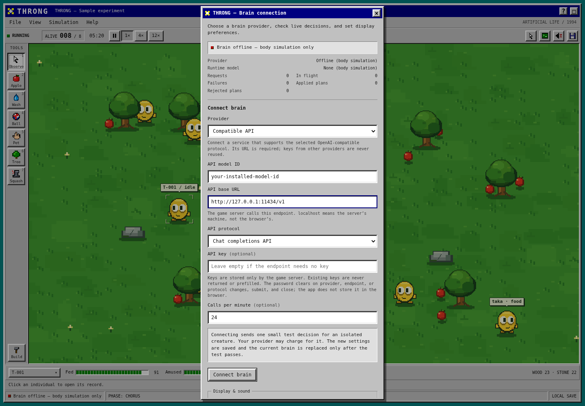

# Choose a brain

Open **Simulation → Connect brain**. Provider, model, and endpoint are separate choices. You can change them without creating a new world. The game supplies one creature's context, and a model returns a decision that must pass the game engine's checks.

## Anthropic / Claude

Choose **Anthropic API**, enter the exact model ID available to your account (for example, `claude-sonnet-5`), and enter your Anthropic API key. Click **Connect brain**.

The adapter uses Anthropic's Messages API with a structured decision tool. That tool only returns a creature action; it cannot execute shell commands or access your files. Other Claude model IDs can be entered directly. Supported features still depend on the chosen model.

## OpenAI / Codex API models

Choose **OpenAI API**, enter your API model ID and OpenAI API key, then click **Connect brain**. This uses the official OpenAI **Responses API** with a strict JSON decision schema.

`gpt-5.3-codex` and `gpt-5.2-codex` are examples whose official API cards list Responses and Structured Outputs support. Your account must have access. You can also enter another OpenAI model that supports that combination. The game requests low reasoning effort for those two Codex IDs to leave more of its bounded output budget for a decision.

The **Codex CLI/app** and this game's API adapter are separate integrations. Throng does not read an existing Codex login, ChatGPT session, or Claude Code login. Enter a provider API key or connect a supported model server. It does not run a coding agent with access to the workstation.

Official references: [Codex model card](https://developers.openai.com/api/docs/models/gpt-5.3-codex), [GPT-5.2-Codex model card](https://developers.openai.com/api/docs/models/gpt-5.2-codex), [Structured Outputs](https://developers.openai.com/api/docs/guides/structured-outputs), and [reasoning token limits](https://developers.openai.com/api/docs/guides/reasoning). Consulted 16 September 2026; account-specific access is checked when you connect.

## Local or hosted compatible servers

Choose **Compatible API** and enter:

- **API base URL:** the server's base path, including `/v1` when required. Do not append `/chat/completions` or `/responses`; the game adds that.
- **API model ID:** the exact model name installed on that server or offered by the provider.
- **API protocol:** **Chat completions API** or **Responses API**, matching the server.
- **API key:** the key for that server, or leave it empty for a server without authentication.

For example, an Ollama server on the **same machine as Throng** can use:

| Field | Value |
| --- | --- |
| Provider | Compatible API |
| API base URL | `http://127.0.0.1:11434/v1` |
| API protocol | Chat completions API |
| API model ID | The exact name of a model you have downloaded in Ollama |
| API key | Empty for an unauthenticated local server |

Start the model server first. Ollama documents a subset of the OpenAI API; other servers may expose a different subset. See [Ollama's compatibility documentation](https://docs.ollama.com/api/openai-compatibility). The game checks the selected protocol by requesting one valid decision. A server being reachable alone is not enough.



**The game server makes the request.** `localhost` refers to its machine. If Throng is on a remote computer and the model is on your Mac, these are different machines; the server needs an address or tunnel that reaches your model.

Use HTTPS for remote servers. Plain HTTP is accepted only for loopback addresses (`localhost`, `127.0.0.1`, or `::1`). URLs cannot contain a username, password, query string, or fragment. Keys are sent in an Authorization header only when you enter one, and redirects are not followed. Switching an endpoint clears the entered key. Leaving the compatible key empty also clears a previously saved compatible key.

Compatible mode sends a JSON-only instruction and the action schema without requiring vendor-specific structured-output extensions. The response still must be complete, valid JSON with a legal action. Not every model or service implements these protocols; arbitrary websites, CLI sessions, and unsupported native APIs cannot be plugged in directly.

## Claude on Amazon Bedrock

Choose **Claude on Amazon Bedrock**, enter the Claude model or inference-profile ID and its AWS region, then connect. The adapter uses the game server's existing AWS credential configuration. There is no browser form for AWS access keys. This adapter is for Claude models on Bedrock, not every Bedrock model family.

## Offline mode

Choose **Offline (body simulation)** and click **Connect brain**. No test request is made. The body simulation and its local preference updates continue; existing model requests are canceled. Saved creature histories and goals remain. This is also the default for new installations.

## Manual configuration

You can edit `.env` on the **game server** instead of using the dialog. Restart the server after manual changes. Set only the provider you intend to use; unrelated API keys do not activate model planning.

Example for OpenAI:

```dotenv
THRONG_BRAIN=openai
THRONG_MODEL=gpt-5.3-codex
OPENAI_API_KEY=your-own-api-key
THRONG_CALLS_PER_MINUTE=24
THRONG_THINK_INTERVAL_SECONDS=8
THRONG_BRAIN_TIMEOUT_MS=25000
```

Example for a compatible local model server:

```dotenv
THRONG_BRAIN=compatible
THRONG_MODEL=your-installed-model-id
COMPATIBLE_BASE_URL=http://127.0.0.1:11434/v1
COMPATIBLE_API_STYLE=chat-completions
COMPATIBLE_API_KEY=
THRONG_CALLS_PER_MINUTE=24
THRONG_THINK_INTERVAL_SECONDS=8
THRONG_BRAIN_TIMEOUT_MS=25000
```

For Anthropic, use `THRONG_BRAIN=anthropic`, your model ID, and `ANTHROPIC_API_KEY`. For Bedrock, use `THRONG_BRAIN=bedrock`, your Claude model/profile ID, and `AWS_REGION`. Offline mode needs only `THRONG_BRAIN=local`.

Legacy manually configured `OPENAI_BASE_URL` values are still read with the OpenAI Responses adapter. Prefer **Compatible API** for custom servers. Connecting through the **OpenAI API** dialog always resets that endpoint to the official OpenAI API before using the newly entered key.

## Verification, limits, and privacy

Connecting an external provider makes **one isolated test decision before saving or switching**. It uses a synthetic creature, with no saved world or player messages. The provider may charge for that call. Failed checks leave the previous connection in place. Closing the dialog cancels a pending check before the settings commit. If saving has already committed, the selected provider remains configured; reopen the dialog to see its live status. Offline selection makes no call.

After connection, real colony requests use selected memories, observed objects, needs, relationships, earlier goals and lessons, and recent messages sent through Colony voice. That context goes to your selected provider. Keys are used for authentication, never included in creature prompts, snapshots, histories, or source exports.

The default dialog budget is 24 colony requests per wall-clock minute, with at most two in flight. The connection test is separate from that quota. Each creature normally waits at least eight simulated seconds between attempts, although important events can prompt an earlier attempt within the colony budget. Provider changes keep the process's rolling quota; new counters describe the new connection.

Responses have a 1,600-token output ceiling, and the dialog configures a 25-second timeout. Reasoning tokens can use part of that output budget. The request limits keep usage bounded; they do not guarantee a slow or reasoning-heavy model will finish. Refused, truncated, malformed, stale, or physically invalid decisions are rejected. The body's survival behavior continues while a model is busy or unavailable.

`npm run check:brain` checks your saved provider with one request and a synthetic creature without modifying the database. `npm run check:claude` remains an alias for older instructions and checks whichever provider is selected. Both are opt-in live checks. Automated tests and documentation screenshots use fake responses or offline simulation; they do not call paid models.

## Troubleshooting

- **No colony plans after a passed test:** hatch the egg, resume the world, and watch requests, failures, and applied plans. The isolated test is not counted as a colony plan.
- **Authentication failed:** use a key for the chosen provider and model. Compatible servers do not inherit another provider's key.
- **Invalid decision:** choose a model that follows JSON instructions. Check whether the server needs Chat completions or Responses. Smaller models may not follow all evidence and action constraints.
- **Timed out or incomplete:** warm up a local model, choose a faster model, or reduce its reasoning settings on the model server. A 1,600-token ceiling may be insufficient for some models. The old brain remains selected if the connection test fails.
- **Server unavailable:** check that it is running and reachable from the machine running Throng. Check its base URL, model name, and protocol.
- **Saved settings differ after restart:** shell environment variables take precedence over `.env`. Remove old exported overrides when using the connection dialog.

See [the architecture](ARCHITECTURE.md) for the decision contract and scheduling details.
